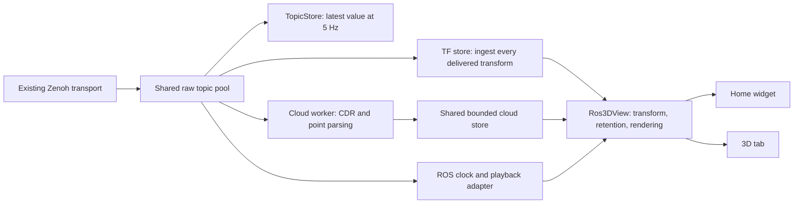

# ROS 3D widget and tab — implementation plan

Status: implemented and tested with synthetic Lyrical/rmw_zenoh data. Usage, exact limits,
playback adapter behavior, and verification notes are in [ROS_3D.md](ROS_3D.md).
The design below records the original scope; the implementation notes take precedence.

User clarification during implementation: playback is primarily controlled externally. The
point-cloud widget and 3D tab show read-only playback status. Optional controls live in the
separate `rosbag_playback` widget. Paused seek recovery required the optional TF-aware replay
adapter after native rosbag2 testing confirmed that the missing past data is not republished.

Confirmed deployment baseline: **ROS 2 Lyrical with rmw_zenoh throughout**. Use the dashboard's
current working dependency versions and deployed transport as the implementation baseline.
Dependency upgrades, other ROS distributions, and alternative middleware are outside this work.

| Confirmed input | ROS message type |
| --- | --- |
| `/tf` | `tf2_msgs/msg/TFMessage` — dynamic transforms |
| `/tf_static` | `tf2_msgs/msg/TFMessage` — static transforms |
| `/ouster/points` | `sensor_msgs/msg/PointCloud2` — initial cloud display |

A complete user recording is not currently available and is **not a prerequisite**. Build a
deterministic Lyrical publisher and generated test bag for these topics. The actual frame IDs,
point fields, and rates will be discovered from messages; do not infer a frame name or binary
layout from `/ouster/points`. A real recording can later refine performance limits and validate
the deployed sensor configuration.

## 1. Product shape

Add a Home widget (`type: pointcloud`) and an opt-in **3D** tab (`ros3d`, `#/ros3d`). Both use
the same `Ros3DView` component and scene configuration. The widget offers a compact toolbar;
the tab adds a display list, frame diagnostics, and source/time controls.

| Capability | First version |
| --- | --- |
| Point clouds | Discover `sensor_msgs/msg/PointCloud2`; add multiple independent topic layers |
| Coordinates | Select a fixed frame; transform every layer through `/tf` and `/tf_static` |
| Retention | Latest scan or a bounded history per layer; clear accumulated scans |
| Appearance | Point size, opacity, flat color, height, intensity, packed RGB/RGBA |
| Navigation | Orbit, pan, zoom, perspective/orthographic, top view, fit, optional follow frame |
| Context | Grid, origin axes, optional TF frame axes/labels/tree |
| Diagnostics | Missing frames, TF timing failures, stale data, point counts, receive/render rates, drops |
| Playback | Follow ROS playback time; preserve paused scenes; reset and rebuild on seeks/loops |
| Configuration | YAML defaults, validated runtime controls, locally remembered view preferences |

Leave the existing **Clouds** tab as the file viewer. The new view can later support other ROS
display types, but v1 does not include URDF, markers, images, paths, LaserScan conversion,
point editing, map export, or direct browser loading of bags. Scan accumulation is a display
history, not SLAM or a persistent map. Per-point LiDAR motion compensation is a later feature:
v1 treats each cloud as one rigid scan at its header timestamp.

## 2. Existing code and the important seams

Paths below are relative to this repository.

| Existing seam | Use / required change |
| --- | --- |
| `app/src/transport/types.ts`, `zenohRemoteApi.ts` | Reuse Zenoh transport and its query target/consolidation options |
| `app/src/ros/graph.ts`, `RosGraphContext.tsx` | Reuse topic discovery, domain/type/hash identities, connection lifetime |
| `app/src/ros/topicStore.ts` | Preserve the current readout API; move raw subscription ownership into a shared pool |
| `app/src/schema/decoders/staticDefs.ts` | Reuse the bundled ROS 2 CDR reader; add explicit PointCloud2/TFMessage/Clock fixtures |
| `app/src/clouds/vendor/core/PointCloudViewer.ts` | Reference for controls, Z-up rendering, coloring, and precision handling |
| `app/src/clouds/vendor/VENDORED.md` | Preserve the upstream synchronization boundary |
| `app/src/home/widgets/specs.ts`, `widgets/builtins.tsx` | Register the config parser and lazy widget component |
| `app/src/config/schema.ts`, `shell/Shell.tsx`, `shell/TabBar.tsx` | Add opt-in tab and shared scene defaults |
| `app/src/playback/` | Reuse playback discovery/control where applicable; introduce a ROS scene time adapter |

Preserve the existing Lyrical graph handling: appended liveliness fields and backend-suffixed
data keys already have support in `graph.ts`. Obtain subscription keyexprs from that graph,
including its `/**` suffix, rather than reconstructing bare keys from topic names. Keep the
current bundled decoder implementation and validate it against messages serialized by Lyrical;
the bundle's `ros2jazzy` label alone is not a reason to replace working dependencies.

Two implementation constraints rule out simply connecting `useTopic()` to the existing viewer:

- `TopicStore` replaces pending messages and decodes at 5 Hz. This loses TF updates, including
  different frame edges published in separate messages. Its transient-local seed also takes
  only the first reply and skips seeding if a live sample arrives first.
- `PointCloudViewer.setPointCloud()` clears the old geometry, restores styling, rebuilds the
  grid, and fits the camera. It owns one cloud and runs an animation loop continuously. That
  API is unsuitable for multiple streaming layers and retained scans.

Use a small dashboard-owned Three.js scene controller under `ros3d/`. Reuse the existing
Three.js dependency and suitable utility modules. Avoid a broad vendor refactor; any copied
shader code must retain provenance/license information. Advanced EDL styling can follow the
first working scene.

## 3. Shared data architecture



- Add a refcounted `TopicStreamPool` beneath `TopicStore`. One data keyexpr gets one raw
  subscription across readouts, TF consumers, the widget, and the tab. Retain attachment and
  sample keyexpr metadata. Keep cached-history queries explicit, since their merge policy is
  consumer-specific. Preserve linger, teardown, reconnect, and stale-async guards.
- `TopicStore` remains the 5 Hz presentation adapter. Rate-only consumers must still avoid
  decoding. A stream consumer must never inherit latest-message coalescing from this adapter.
- One `TfStore` per transport session, domain, and configured TF topic set processes all
  delivered transforms. Ingestion is independent of React updates. Surface overload or
  detected transport loss; do not claim the network guarantees lossless delivery.
- One `PointCloudStore` shares parsing and immutable typed arrays per topic/layout. TF lookup,
  appearance, camera, and accumulation policy belong to each scene. Share CPU data where
  possible; separate canvases still require separate GPU uploads.
- Use a bounded worker queue. Latest mode may replace pending cloud work; accumulation mode
  keeps a bounded FIFO and explicitly reports evictions. Worker results carry source/epoch
  generations so obsolete results cannot repopulate a reset scene.
- Buffer ownership must be explicit: never transfer/detach bytes still held by another pool
  consumer. Make an owned copy for worker transfer when required, then transfer parsed output.

Discovery must resolve full domain/topic/type/hash identity. A scene uses one ROS domain and
one time source; ambiguous topic names require selection instead of silently choosing the
first match. Frame names are not automatically prefixed or merged across unrelated sources.

## 4. Transform behavior — correctness before rendering polish

Use `lookupTransform(targetFrame, sourceFrame, stamp)` with a tested, UI-independent buffer.
For a cloud stamped `t` in frame `sensor`, compute:

```text
p_fixed = T_fixed_from_sensor(t) * p_sensor
```

The cloud's header identifies its acquisition time and coordinate frame. The binary layout
is separately described by its fields and strides.
([Lyrical PointCloud2 definition](https://raw.githubusercontent.com/ros2/common_interfaces/lyrical/sensor_msgs/msg/PointCloud2.msg))

For each TransformStamped, store the child's pose in its parent: its translation/rotation maps
child coordinates into parent coordinates. Support chain composition, inverse traversal, and
identity when source equals target. Test direction with an asymmetric translation plus rotation,
not only an identity transform.
([Lyrical TransformStamped definition](https://raw.githubusercontent.com/ros2/common_interfaces/lyrical/geometry_msgs/msg/TransformStamped.msg))

Required buffer behavior:

- Dynamic samples indexed by child and timestamp, retaining parent identity per sample; bounded
  by both time and sample count. Start with a configurable 10-second history.
- Exact timestamp lookup, linear translation interpolation, quaternion SLERP. Do not interpolate
  across a parent change. No silent extrapolation or substitution of a current transform for a
  timestamped scan. TF2's implementation provides the reference for these operations.
  ([Lyrical TF2 time cache](https://raw.githubusercontent.com/ros2/geometry2/lyrical/tf2/src/cache.cpp))
- Static edges valid at any time, separately retained and merged by child frame; a TFMessage
  is a batch of transforms, not a complete tree snapshot.
  ([TFMessage](https://raw.githubusercontent.com/ros2/geometry2/rolling/tf2_msgs/msg/TFMessage.msg),
  [TF2 static cache](https://raw.githubusercontent.com/ros2/geometry2/rolling/tf2/src/static_cache.cpp))
- Subscribe before requesting static history. Query all matching publishers without reply
  consolidation, merge every reply even when live traffic has started, and deduplicate replay
  against live samples. Use publisher/sequence metadata where available; conflicting values
  without sufficient ordering evidence become diagnostics. Refresh on publisher-set changes
  and reconnect. Verify this behavior with multiple synthetic static publishers on the existing
  Lyrical/rmw_zenoh deployment; this is a feature-specific check, not a transport migration.
- Validate frame IDs, finite values, and quaternion norms; reject zero/invalid rotations and
  normalize only within a documented tolerance. Detect cycles, disconnected trees, conflicting
  parents/authorities, and static/dynamic ownership conflicts. Do not silently repair topology.
- Keep timestamps as integer nanoseconds (`bigint`, or an equivalent seconds/nanoseconds pair).
  Convert only bounded time differences for interpolation. Keep an explicit distinction between
  timestamp zero and a request for latest-common-time; v1 diagnoses zero-stamped dynamic clouds
  rather than accidentally interpreting them as "latest".

Clouds arriving ahead of TF enter a bounded pending queue and are retried when relevant TF
arrives. Separate waiting, unknown frame, disconnected path, expired history, and future
extrapolation statuses. Start with a 500 ms live wait budget, configurable and subject to
playback-specific handling. Expired clouds are dropped with a reason. Do not draw them in the
wrong frame. Keep the last valid scan visibly marked stale when its replacement cannot render.

In accumulation mode, retain each scan with its resolved transform at acquisition time. New
vehicle poses must not drag old scans around. Use `map` or `odom` when a world-stable history is
desired. A moving fixed frame such as `base_link` gives a different interpretation; camera
follow is a separate option and should usually be used to follow the vehicle in a world frame.
Changing the fixed frame clears retained scans in v1, then rebuilds from incoming data.

## 5. PointCloud2 parsing and scene performance

Implement a pure parser, called from a worker after CDR decoding:

- Respect `width`, `height`, `point_step`, `row_step`, field offsets/counts, and the point blob's
  endianness independently of CDR endianness. Support organized clouds and row padding.
- Require usable scalar `x`, `y`, `z`; support FLOAT32 and FLOAT64 coordinates and standard
  numeric fields. Validate lengths/strides/offset arithmetic before allocations or reads.
- For `/ouster/points`, use the actual `fields` metadata and `header.frame_id`. Expose available
  scalar fields for coloring (for example intensity or reflectivity when present), without
  assuming a particular Ouster driver profile, point stride, ring count, or sensor frame.
- Skip non-finite coordinates even if `is_dense` says true. Preserve correct attribute indexing
  through filtering and deterministic point-budget sampling.
- Decode packed `rgb`/`rgba` by bit interpretation, including FLOAT32-packed color. Support
  scalar intensity and height coloring. Unavailable coloring fields produce an explicit status.
- Cover PointField codes 1–8. Lyrical also defines INT64/UINT64/BOOL; handle 9–11
  explicitly, with safe numeric conversion rules and diagnostics for unrepresentable values.
  Never silently treat an unknown datatype as FLOAT32.
  ([Lyrical PointField definition](https://raw.githubusercontent.com/ros2/common_interfaces/lyrical/sensor_msgs/msg/PointField.msg))

Keep positions local to the scan and apply one object matrix per scan. Reuse GPU buffers in
latest mode; pool and dispose retained-scan buffers on eviction. Use double-precision CPU
transform math and a nearby render origin before Float32 GPU upload, including for large
georeferenced positions. Use meters and Z-up in the scene; optical-frame orientation comes
from TF, not from a special axis swap in the parser. Height color means height in the selected
fixed frame, not unconditionally the incoming sensor's Z coordinate.

Enforce per-message bytes, per-layer pending count, retained duration, point count, and total
CPU/GPU memory budgets. Initial tuning candidates: 5 seconds of history when enabled, 2 million
retained points per scene, 256 MiB of cloud data across the app, and a 30 FPS render ceiling.
These are proposed limits, not measured capacity; benchmark actual clouds on the operator's
browser before setting defaults. Browser subsampling reduces rendering work, not wire bandwidth;
offer producer-side downsampling/rate limiting if the transport is the bottleneck.

The shell keeps visited tabs mounted. Pass explicit visibility into the new view: hidden views
stop drawing and uploading, while shared ingestion and bounded history continue. Cap total
memory across hidden views, resize on reveal, and dispose workers/resources when the final
consumer releases them. Test WebGL context loss/recovery and camera-state preservation.

## 6. Playback is part of v1

Playback means consuming republished ROS topics through the same transport. Use the source's
ROS timeline, normally `/clock`; message headers remain authoritative for TF lookup. Wall or
monotonic time is for transport health and bounded resource management, not transform lookup.
Freeze scan decay while source time is paused. A UI "freeze view" control, if added, must be
distinguished from pausing the publisher.

The three confirmed recorded topics do not imply that `/clock` is recorded. Configure the
Lyrical player to publish the playback clock, with one authoritative clock source. A recorded
`/clock` topic is not required. Test the generated bag with only `/tf`, `/tf_static`, and
`/ouster/points` recorded and the clock supplied by the player. If no playback clock or adapter
is available, report that timeline state is unavailable; do not infer a seek from every
out-of-order sensor timestamp or label an idle source as definitely paused.

Introduce a `SceneTimeSource`/playback adapter that exposes time, paused state, source identity,
capabilities, and discontinuity generation. Bind it explicitly to the scene. Use the existing
playback contract when the source advertises it, and a ROS bag player adapter for ROS service
controls. Target Lyrical's rosbag2 player services and resolve their deployed schemas through
the existing service client. Discover capabilities rather than adding a cross-distribution
compatibility layer. ([Lyrical rosbag2 playback services](https://github.com/ros2/rosbag2/blob/lyrical/README.md#controlling-playback-via-services))

The current `PlaybackOp` union has pause/resume/speed/loop/restart, but no arbitrary seek.
Do not add a seek button that sends an unsupported operation. Render source controls only for
verified capabilities; playback visualization and reset behavior must also work when playback
is controlled outside the dashboard. A native bag player may loop through its startup config
without exposing a runtime loop toggle.

On a seek, loop, source replacement, or transport session change:

1. Advance the epoch and invalidate pending worker jobs/TF waits.
2. Clear dynamic TF and displayed/retained scans.
3. Preserve static TF only for a verified unchanged source; otherwise clear and reload it.
4. Restore applicable static transforms and enough dynamic TF around the destination time.
5. Resume cloud admission when timestamped transforms are available.

Observe backward `/clock` jumps and explicit player discontinuity events; ordinary out-of-order
cloud/TF packets are not seeks. Forward seeks need adapter events or a documented clock-jump
detection policy; a silent topic stream cannot unambiguously identify every forward seek.
Fence in-flight pre-seek transport data as well as worker results. Reliable epoch boundaries
require player cooperation, or a tested pause/drain/reset/resume sequence.

**Early integration gate:** demonstrate TF recovery when seeking into the middle of the generated
test bag, including while paused. A browser cannot recover unpublished past transforms. If the
Lyrical player does not restore static state and sufficient TF history, add producer/adapter support
for TF pre-roll and destination state before declaring seeking complete. Do not substitute
latest TF or make the user restart from the beginning. A source lacking the necessary time/reset
contract can still render topic data, but does not meet v1 seek acceptance.

## 7. Proposed configuration

Use one pure `Ros3DSceneConfig` parser for tab defaults and widget overrides. This example is a
proposed schema, not currently accepted by the dashboard:

```yaml
tabs: [cameras, ros, ros3d]

ros3d:                       # tab scene + defaults inherited by pointcloud widgets
  # domain_id: 0            # example only; select the domain advertised by this deployment
  fixed_frame: odom         # illustrative; choose an actual frame discovered in TF
  tf_topics: [/tf]
  tf_static_topics: [/tf_static]
  time_source: ros_clock     # live | ros_clock; live is the default
  clock_topic: /clock
  # follow_frame: base_link # optional; only if that frame exists
  show_frames: true
  displays:
    - id: ouster
      topic: /ouster/points
      color: { mode: height } # intensity/other scalar fields selectable when present
      point_size: 2
      history_s: 5           # 0 = latest scan only

home:
  version: 1
  widgets:
    - type: pointcloud
      label: Surroundings
      span: full
      # Scene fields may override the ros3d defaults above.
      # An overridden displays list replaces the inherited list.
```

TF topic sets and clock topics are configurable for namespaced deployments. The first tab
visit can also start empty and offer graph-based topic/frame selection. Validate all numeric
bounds, duplicate display IDs, and field choices; preserve existing per-widget error isolation.
Remember configuration choices and camera pose, never point buffers. "Open in 3D" carries the
widget's effective scene configuration into the tab when that tab is enabled.

## 8. Implementation order and acceptance

| Increment | Deliverable | Exit check |
| --- | --- | --- |
| 1. Lyrical fixture and playback proof | Deterministic publisher on the three confirmed topics, generated bag, all-publisher static hydration and mid-bag seek experiment using existing versions | Known geometry and Lyrical serialization establish correctness; clock/seek requirements identified without a user bag |
| 2. Subscription and TF foundation | Shared raw pool, unchanged readout adapter, tested TF store | Multiple TF publishers preserve all edges; timestamped chains agree with native tf2 |
| 3. First cloud | Worker parser + persistent scene controller + one topic in a chosen fixed frame | Padded/endian/color fixtures render correctly; camera stays stable across updates |
| 4. Full scene | Multiple layers, pending-TF handling, bounded accumulation, follow/frame diagnostics | Moving-sensor scans align on a stationary target; queues/memory stay bounded |
| 5. Playback completion | Time adapter, epoch resets, source controls where supported, required producer TF recovery | Pause, forward/backward seek, loop, mid-bag attach, and seek while paused pass |
| 6. Dashboard integration | Lazy widget/tab, YAML, persistence, visibility handling, documentation | Both surfaces share subscriptions/parsing; tab changes preserve view without hidden rendering |

Automated coverage should focus on behavior:

- TF composition/inversion/interpolation, static chains, timestamp precision, parent changes,
  out-of-order input, invalid quaternions, cycles, disconnected paths, and extrapolation.
- Binary cloud fixtures: padding, reordered fields, both endian modes, FLOAT64 XYZ, NaNs,
  packed colors, empty/malformed/oversized clouds, and budget sampling.
- Integration with fake transport: several static publishers, replay/live races, reconnect,
  delayed TF, decoder initialization bursts, shared acquisition/release, stale worker results,
  and no accidental decoding for rate-only widgets.
- Playback fixtures with explicit epochs and `/clock`: paused retention, both seek directions,
  loops, source replacement, old in-flight samples, static restoration, and TF pre-roll.
- Component coverage for topic/frame selection, per-layer settings/status, YAML error isolation,
  lazy mounting, and disabled-tab navigation. Real-browser checks cover WebGL behavior.

The decisive end-to-end fixture starts with a simulated sensor on `/ouster/points` attached to
a translating/rotating base viewing known stationary geometry. Generate points by applying the
inverse known sensor pose to world geometry; publish the corresponding moving edges on `/tf`
and fixed sensor extrinsics on `/tf_static`. Example test frames are
`map -> odom -> base_link -> test_ouster`; these are fixture names, not assumptions about the
vehicle. Have two independent static publishers contribute different edges. Publish static
transforms before the dashboard connects, and keep their publishers alive for late-join tests.

Provide a second synthetic topic in the fixture's multi-layer mode to verify overlays. Add
switches for delayed/out-of-order TF, point-field layouts, and cloud sizes/rates. Compare
transformed coordinates against native Lyrical tf2 and the visual result against Lyrical RViz
in `map`, `odom`, `base_link`, and a sensor frame. Generate a small repeatable bag from this
publisher and test pause, both seek directions, loops, late joins, and seek while paused using
Lyrical rosbag2 with rmw_zenoh and the dashboard's existing transport/dependency versions.

Keep the fixture generator and expected results in the repository; generate bag files as test
outputs instead of requiring a supplied recording or committing large binaries. Capture CDR
fixture bytes through Lyrical's serializer as an independent check on the dashboard's existing
reader, rather than relying only on a same-library write/read round trip.

Measure input bandwidth, parse time, render rate, drop counts, and steady-state CPU/GPU memory
with the same widget and tab active. Synthetic results establish bounded behavior, not actual
Ouster throughput. Run the existing test suite and production build after integration.

The ROS distribution, middleware, and three initial topics are settled. Inspect the current
deployment for player launch settings and build identities when running integration tests;
reuse its working versions. Actual vehicle frame IDs, Ouster field layout/rate, and operator
hardware are later discovery/tuning inputs. A representative real recording is useful for
final field validation when available, but does not block implementation or synthetic acceptance.
